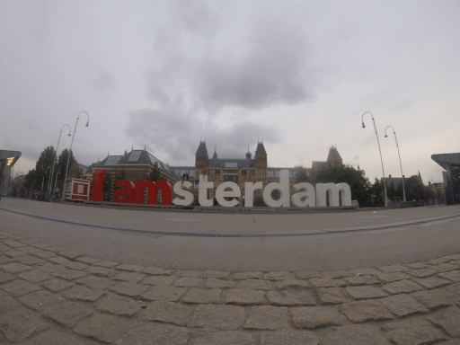

# `MedianFilter`
	
	Package MedianFilter implements a simple library for image operations. The library can work with pngs or jpgs. Same functions can be used for both of those image types.

98% Test coverage

---
#### Full Documentation:

https://godoc.org/github.com/KorayGocmen/MedianFilter

```go
package main

import (
	"io/ioutil"
	"log"

	"github.com/koraygocmen/MedianFilter"
)

func main() {
	files, err := ioutil.ReadDir("./test-frames/")
	if err != nil {
		log.Fatal(err)
	}

	var filePaths []string
	for _, f := range files {
		filePaths = append(filePaths, "./test-frames/"+f.Name())
	}

	if err := MedianFilter.RemoveMovingObjs(filePaths, "./out.jpg"); err != nil {
		log.Fatal(err)
	}
}
```

## Result
 

 to

 

### Thanks 
---

Nikolas Moya, for writing the very informative [Medium Article](https://medium.com/@nikolasmoya/simple-algorithm-to-remove-moving-objects-from-pictures-cdd3396c68e0) explaning the concept and providing the test frames used in this code.